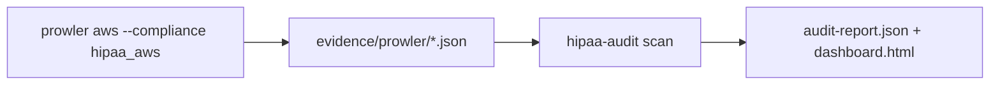

# Prowler ↔ HIPAA Security Rule crosswalk

Prowler's upstream catalog [`hipaa_aws.json`](https://github.com/prowler-cloud/prowler/blob/master/prowler/compliance/aws/hipaa_aws.json)
maps automated AWS checks to HIPAA implementation specifications.

hipaa-audit control `HIPAA-INT-001` ingests Prowler JSON output; this doc explains how
Prowler requirements align with our YAML catalog.

## Run Prowler HIPAA mode

```bash
prowler aws --compliance hipaa_aws -M json -o evidence/prowler/
```

## Requirement families

| Prowler section | CFR | hipaa-audit controls (informative) |
|-----------------|-----|-----------------------------------|
| 164.308 Administrative Safeguards | §164.308 | `HIPAA-164.308-*`, `HIPAA-INT-001` |
| 164.312 Technical Safeguards | §164.312 | `HIPAA-164.312-*`, AWS checks in `hipaa_audit/checks/aws.py` |

## Example requirement mapping

| Prowler ID | HIPAA spec | Sample Prowler checks |
|------------|------------|----------------------|
| `164_308_a_1_ii_a` | Risk analysis | `config_recorder_all_regions_enabled`, `guardduty_is_enabled` |
| `164_308_a_1_ii_b` | Risk management | `cloudtrail_kms_encryption_enabled`, `rds_instance_storage_encrypted`, … |
| `164_312_a_2_iv` | Encryption | `s3_bucket_default_encryption`, `ec2_ebs_volume_encryption`, … |
| `164_312_b` | Audit controls | `cloudtrail_multi_region_enabled`, `cloudwatch_log_group_retention` |

Full list: 32 requirements, 85 automated checks (per Prowler Hub).

## Evidence flow



## Limitations

Prowler covers **technical** AWS posture. HIPAA also requires workforce training,
physical safeguards, BAAs, and documented policies — handled by hipaa-audit
`policies/`, `templates/`, and manual controls.

Do not treat a clean Prowler run as full HIPAA compliance.
